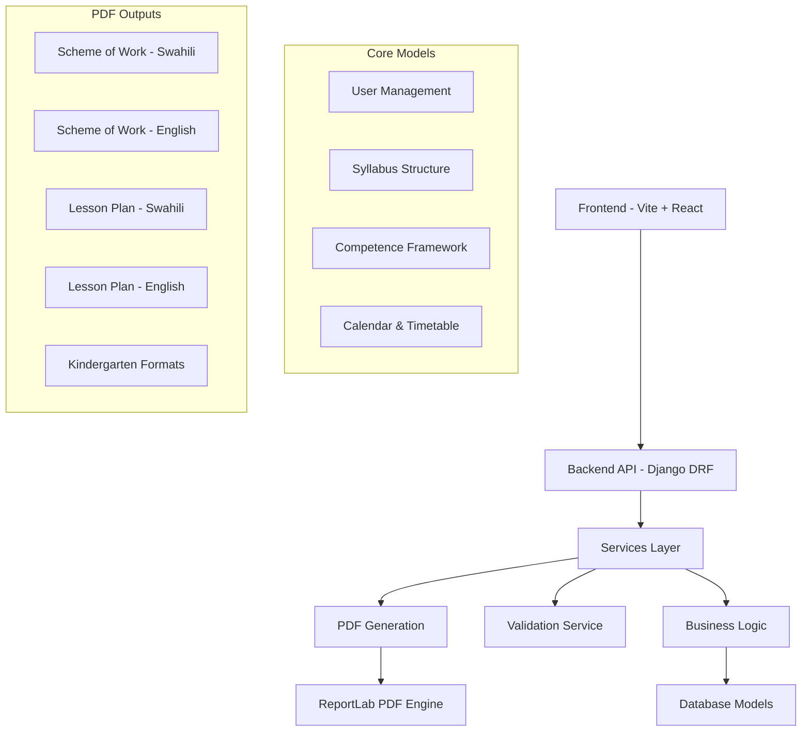
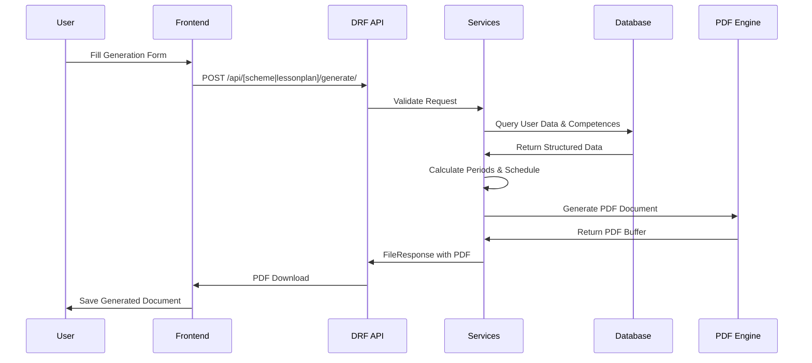

SYLLABUS SYSTEM - COMPLETE ROADMAP

📋 SYSTEM OVERVIEW

Jamiikazini has a comprehensive syllabus management system for Tanzanian teachers that generates Schemes of Work and Lesson Plans in both Swahili and English mediums.

---

🏗️ SYSTEM ARCHITECTURE



---

📁 PROJECT STRUCTURE

```
jamiikazini/
├── 📁 backend/
│   ├── 📁 core/
│   ├── 📁 syllabus/
│   │   ├── 📁 models/
│   │   │   ├── __init__.py
│   │   │   ├── core_models.py
│   │   │   ├── competence_models.py
│   │   │   ├── lesson_models.py
│   │   │   └── user_models.py
│   │   ├── 📁 serializers/
│   │   │   ├── __init__.py
│   │   │   ├── scheme_serializers.py
│   │   │   ├── lessonplan_serializers.py
│   │   │   └── timetable_serializers.py
│   │   ├── 📁 services/
│   │   │   ├── __init__.py
│   │   │   ├── base_pdf_service.py
│   │   │   ├── validation_service.py
│   │   │   ├── scheme_service.py
│   │   │   ├── lessonplan_service.py
│   │   │   ├── timetable_service.py
│   │   │   └── pdf_generator.py
│   │   ├── 📁 views/
│   │   │   ├── __init__.py
│   │   │   ├── scheme_views.py
│   │   │   ├── lessonplan_views.py
│   │   │   └── timetable_views.py
│   │   ├── 📁 utils/
│   │   │   ├── __init__.py
│   │   │   ├── constants.py
│   │   │   └── helpers.py
│   │   └── urls.py
│   ├── 📁 users/
│   └── manage.py
└── 📁 frontend/
    ├── 📁 src/
    │   ├── 📁 components/
    │   │   ├── 📁 LessonPlan/
    │   │   ├── 📁 Scheme/
    │   │   ├── 📁 Common/
    │   │   └── 📁 Forms/
    │   ├── 📁 pages/
    │   ├── 📁 services/
    │   ├── 📁 utils/
    │   └── App.jsx
    └── package.json
```

---

🗓️ DEVELOPMENT ROADMAP

PHASE 1: BACKEND CORE (Week 1-2)

🎯 Milestone 1.1: Database Models & Relationships

📋 Checklist 1.1 - Models Setup

Core Models (core_models.py)

· Masomo (Subjects) - Store all subjects with language and level flags
· ClassLevel (Class standards) - Class levels with notation (Std I, II, etc.)
· TimeTable (Teacher timetable) - Links teachers to classes and subjects
· AnnualCalendar (Academic calendar) - Term dates, holidays, weeks
· UserProfile extension - Extend user model with teacher-specific data

IMPLEMENTATION NOTES:

· Masomo model must have is_english and is_awali flags for language and level detection
· TimeTable should track registered boys/girls for attendance validation
· AnnualCalendar needs precise week calculations for scheme scheduling

Competence Models (competence_models.py)

· MainCompetence (Umahiri Mkuu) - Broad competence areas per subject
· SpecificCompetence (Umahiri Mahususi) - Detailed competences under main
· Activities (Shughuli Kuu) - Main teaching activities
· SpecificActivities (Shughuli Mahususi) - Detailed student activities with period counts
· Methodology (Mbinu za Ufundishaji) - Teaching methodologies per activity

IMPLEMENTATION NOTES:

· Maintain strict foreign key relationships for data integrity
· SpecificActivities must have total_periods for scheme calculations
· Methodology links to SpecificActivities for lesson plan generation

Lesson Models (lesson_models.py)

· Utangulizi, Kuimarisha, Hitimisho (Swahili teaching stages)
· Introduction, Development, Design, Realization (English equivalents)
· Maoni, Selected (User selections and comments)

IMPLEMENTATION NOTES:

· Use random selection (order_by('?')[0]) for varied lesson content
· Maintain parallel structures for Swahili and English versions
· Selected model tracks user's current subject/class selections
'''

Database Operations

· Create migrations with proper relationship constraints
· Run migrations and verify foreign key integrity
· Create initial data fixtures for subjects, classes, competences
· Test model relationships with sample queries

🎯 Milestone 1.2: DRF API Foundation

📋 Checklist 1.2 - API Setup

Serializers

· SchemeRequestSerializer - Validate subject, classlevel, year, scheme_type
· LessonPlanRequestSerializer - Handle specificactivity, timings, attendance data
· TimeTableSerializer - Manage teacher's class-subject assignments
· CompetenceSerializer - Provide competence data for frontend dropdowns

IMPLEMENTATION NOTES:

· Include comprehensive field validation in serializers
· Handle file responses for PDF generation endpoints
· Use proper error messaging for validation failures

API Views Structure

· Base API view classes with common authentication
· JWT token authentication setup
· Permission classes for teacher-only access
· Standardized response formatting with error handling

IMPLEMENTATION NOTES:

· Use @method_decorator(login_required) for view protection
· Implement proper status codes (400, 403, 500) for different error scenarios
· Handle FileResponse for PDF downloads

URL Routing

· RESTful API endpoint routes (/api/scheme/generate/, /api/lessonplan/generate/)
· API versioning setup for future updates
· Swagger/OpenAPI documentation setup

---

PHASE 2: SERVICES LAYER (Week 3-4)

🎯 Milestone 2.1: Core Services Architecture

📋 Checklist 2.1 - Services Foundation

Base PDF Service (base_pdf_service.py)

· PDF document setup with encryption and page configuration
· ReportLab style management for consistent formatting
· Table generation utilities for structured data presentation
· Time calculations for lesson plan stage distribution

IMPLEMENTATION NOTES:

· Use StandardEncryption("", canModify=0, canCopy=0) for PDF protection
· Implement landscape mode for schemes, portrait for lesson plans
· Create reusable table styles for consistent appearance

Validation Service (validation_service.py)

· User authentication and teacher profile validation
· Timetable existence check before generation
· Payment status validation for premium features
· Form data validation and error messaging

IMPLEMENTATION NOTES:

· Check user.has_paid() before processing requests
· Validate attendance numbers dont exceed registered counts
· Provide clear Swahili/English error messages

🎯 Milestone 2.2: Scheme Generation Service

📋 Checklist 2.2 - Scheme Service

Base Scheme Service (scheme_service.py)

· Period calculations based on total periods and weekly allocation
· Calendar week management with term break integrations
· Competence data aggregation across main/specific competences
· Time distribution logic for annual scheduling

IMPLEMENTATION NOTES:

· Calculate studying_weeks = (total_learningdays / 5) - 6
· Handle period distribution when wiki_hitajika > studying_weeks
· Implement week/month progression algorithms

Swahili Scheme Service

· Header generation with "AZIMIO LA KAZI" title
· Table structure following Tanzanian Swahili format standards
· Competence mapping with proper Swahili terminology
· Term break integrations with Swahili labels

English Scheme Service

· Header generation with "SCHEME OF WORK" title
· Table structure following English format standards
· Competence mapping with English educational terminology
· Holiday period integrations with English labels

IMPLEMENTATION NOTES:

· Handle both A4 landscape layouts
· Implement proper table spanning for headers
· Include school, teacher, and council information
· Add page numbering and footers

🎯 Milestone 2.3: Lesson Plan Generation Service

📋 Checklist 2.3 - Lesson Plan Service

Base Lesson Plan Service

· Time distribution calculations (12.5% intro, 25% development, 37.5% reinforcement, 25% conclusion)
· Activity sequencing based on methodology
· Methodology integration from database
· Assessment criteria and indicators

IMPLEMENTATION NOTES:

· Calculate time deltas between start and finish times
· Distribute time proportionally across teaching stages
· Validate attendance data consistency

Swahili Lesson Plan Service

· "ANDALIO LA SOMO" format with proper Swahili structure
· Swahili teaching stages (Utangulizi, Kujenga Umahiri, Kuimarisha, Hitimisho)
· Student attendance tables with Swahili headers
· Reflection sections with Swahili educational terminology

English Lesson Plan Service

· "TEACHER'S LESSON PLAN" format with international standards
· English teaching stages (Introduction, Development, Reinforcement, Conclusion)
· Pupil attendance tables with English headers
· Reflection sections with English educational terminology

Kindergarten Variations

· Awali/Kindergarten specific formats and layouts
· Simplified competence structures for early childhood
· Activity-based templates with play-oriented language

IMPLEMENTATION NOTES:

· Handle different page sizes (A4 for upper classes, letter for kindergarten)
· Include song integration options (is_song flag)
· Implement repetition flags (be_repeated) for lesson continuity
· Add teaching assessment with managed student counts

---

PHASE 3: FRONTEND DEVELOPMENT (Week 5-6)

🎯 Milestone 3.1: React Frontend Setup

📋 Checklist 3.1 - Frontend Foundation

Project Setup

· Vite + React installation with modern tooling
· Material-UI integration for consistent design
· React Router setup for navigation
· Axios configuration for API communication

IMPLEMENTATION NOTES:

· Use Vite for fast development and optimized builds
· Implement Material-UI theming for professional appearance
· Set up route protection for authenticated sections

API Services (services/api.js)

· Authentication service with token management
· Scheme generation service with form data handling
· Lesson plan service with complex form support
· File download handlers for PDF responses

IMPLEMENTATION NOTES:

· Configure responseType: 'blob' for file downloads
· Implement request interceptors for auth tokens
· Handle API errors with user-friendly messages

State Management

· User context setup for global state management
· Form state management for multi-field forms
· Loading states during PDF generation
· Error handling with toast notifications

🎯 Milestone 3.2: User Interface Components

📋 Checklist 3.2 - UI Components

Form Components

· Scheme generation form with subject/class/year selection
· Lesson plan generation form with activity/timing/attendance fields
· Timetable management form for teacher assignments
· Dynamic field selection with dependent dropdowns

IMPLEMENTATION NOTES:

· Implement cascading dropdowns (subject → specific activities)
· Add form validation with clear error indicators
· Include help text and examples for each field

Display Components

· PDF preview components for generated documents
· Download buttons with progress indicators
· Status indicators for generation progress
· Progress trackers for multi-step processes

Layout Components

· Navigation menu with user profile access
· User dashboard with quick access to features
· Responsive design for mobile and tablet use
· Mobile optimization for teacher field use

---

PHASE 4: INTEGRATION & TESTING (Week 7-8)

🎯 Milestone 4.1: System Integration

📋 Checklist 4.1 - Integration

API Integration

· Frontend-Backend connectivity with proper CORS setup
· File upload/download handling with progress tracking
· Error response handling with user-friendly messages
· Loading state synchronization across components

PDF Generation Integration

· Document template testing across different subjects/classes
· Encryption functionality verification
· File naming conventions with timestamps
· Download reliability with error recovery

🎯 Milestone 4.2: Comprehensive Testing

📋 Checklist 4.2 - Testing

Backend Testing

· Model relationship tests with sample data
· Service logic tests for period calculations
· API endpoint tests with authentication
· PDF generation tests for format consistency

Frontend Testing

· Component unit tests for form validation
· Form validation tests with edge cases
· API integration tests with mock responses
· User flow tests for complete generation processes

Integration Testing

· End-to-end user workflows from login to download
· File download scenarios with different browsers
· Error handling scenarios with invalid data
· Performance testing with concurrent users

---

📊 DATA FLOW DIAGRAM



---

🔧 TECHNICAL SPECIFICATIONS

Backend Stack

· Framework: Django 4.2 + Django REST Framework
· Database: PostgreSQL
· PDF Generation: ReportLab
· Authentication: JWT Tokens
· File Handling: In-memory PDF generation

Frontend Stack

· Framework: React 18 + Vite
· UI Library: Material-UI (MUI)
· Routing: React Router DOM
· HTTP Client: Axios
· State Management: React Context API

Key Dependencies

```python
# Backend
Django==4.2.0
djangorestframework==3.14.0
reportlab==4.0.4
Pillow==9.5.0
python-decouple==3.8

# Frontend
react@^18.2.0
react-dom@^18.2.0
@mui/material@^5.14.0
axios@^1.4.0
react-router-dom@^6.14.0
```

---

🚀 DEPLOYMENT CHECKLIST

Pre-Deployment

· Environment configuration with production settings
· Database production setup with optimized configurations
· Static files configuration for CDN delivery
· SSL certificate setup for secure connections
· Domain configuration with proper DNS records

Deployment Steps

· Backend deployment (PythonAnywhere/AWS/DigitalOcean)
· Frontend build and deployment (Netlify/Vercel)
· Database migration with production data
· Environment variables setup for security
· DNS configuration and domain verification

Post-Deployment

· Functionality testing in production environment
· Performance monitoring with analytics
· Error tracking setup with logging
· Backup configuration for data safety
· User acceptance testing with real teachers

---

📞 SUPPORT & MAINTENANCE

Documentation

· API documentation with example requests
· User manual with step-by-step guides
· Deployment guide for technical teams
· Troubleshooting guide for common issues

Monitoring

· Error logging with detailed context
· Performance metrics for system health
· User analytics for feature usage
· Usage reports for business insights

---

✅ SUCCESS METRICS

· Performance: PDF generation < 5 seconds
· Reliability: 99% uptime with minimal downtime
· Usability: Intuitive form completion < 2 minutes
· Scalability: Support 1000+ concurrent users
· Maintainability: Clear separation of concerns with modular architecture

---

🎯 CRITICAL IMPLEMENTATION DETAILS

Scheme Generation Key Algorithms:

1. Period Calculation:
   ```python
   vipindi_wiki = subject_obj.periods_perweek
   wiki_hitajika = jumla_vipindi / vipindi_wiki
   studying_weeks = (total_learningdays / 5) - 6
   vipindi_utofauti = vipindi_hitajika - vipindi_kusoma
   ```
2. Week Scheduling:
   · Handle 4-term structure with proper break integrations
   · Manage week/month progression with list indexing
   · Calculate mid-term, terminal, and annual breaks

Lesson Plan Key Features:

1. Time Distribution:
   · Introduction: 12.5% of total time
   · Development: 25% of total time
   · Reinforcement: 37.5% of total time
   · Conclusion: 25% of total time
2. Dynamic Content:
   · Random selection of teaching methodologies
   · Song integration options
   · Attendance validation
   · Repetition flags for lesson continuity

Security & Validation:

· PDF encryption to prevent modification/copying
· Payment verification for premium features
· Attendance number validation against registration
· User authentication and authorization checks

This roadmap provides a comprehensive guide for any developer to implement the Jamiikazini' syllabus system without getting stuck. Each milestone includes specific, actionable checklists with detailed implementation notes based on the actual code requirements.
'''

🎯 CRITICAL PDF CONTENT STRINGS

Scheme of Work - Swahili Strings:

```python
# Headers na Titles
"AZIMIO LA KAZI"
"JINA LA MWALIMU:"
"DARASA LA:"
"MUHULA:"
"SOMO:"
"MWAKA:"
"MALENGO:"

# Table Headers
"UMAHIRI MKUU"
"UMAHIRI MAHUSUSI" 
"SHUGHULI ZA UJIFUNZAJI"
"SHUGHULI NDOGO ZA KUTENDWA NA MWANAFUNZI"
"MWEZI"
"WIKI"
"IDADI YA VIPINDI"
"MBINU_ZA UFUNDISHAJI_NA UJIFUNZAJI"
"MAREJELEO"
"ZANA ZA UFUNDISHAJI NA UJIFUNZAJI"
"ZANA ZA UPIMAJI"
"MAONI"

# Break Periods
"MITIHANI YA LIKIZO YA ROBO MUHULA"
"LIKIZO FUPI KUANZIA {date} HADI {date}"
"MITIHANI YA LIKIZO YA MUHULA WA I"
"LIKIZO YA MUHULA WA I KUANZIA {date} HADI {date}"
```

Scheme of Work - English Strings:

```python
# Headers na Titles
"SCHEME OF WORK"
"TEACHER'S NAME:"
"CLASS:"
"TERM:"
"SUBJECT:"
"YEAR:"
"OBJECTIVES:"

# Table Headers
"MAIN COMPETENCE"
"SPECIFIC COMPETENCE"
"LEARNING ACTIVITIES"
"ACTIVITIES TO BE PERFORMED BY THE PUPIL"
"MONTH"
"WEEKS"
"NUMBER OF PERIODS"
"TEACHING METHODOLOGY"
"REFERENCE"
"TEACHING AND LEARNING AIDS"
"ASSESSMENT AIDS"
"REMARKS"

# Break Periods
"FIRST MID-TERM EXAMINATIONS"
"MID-TERM BREAK STARTING {date} UNTIL {date}"
"TERMINAL EXAMINATIONS"
"TERMINAL BREAK STARTING {date} UNTIL {date}"
```

Lesson Plan - Swahili Strings:

```python
# Headers
"ANDALIO LA SOMO"
"JINA LA SHULE:"
"SOMO:"
"MUDA:"
"JINA LA MWALIMU:"
"DARASA LA:"
"KIPINDI CHA:"
"TAREHE:"

# Student Data
"IDADI YA WANAFUNZI"
"WALIOANDIKISHWA"
"WALIOHUDHURIA"
"WAVULANA"
"WASICHANA"
"JUMLA"

# Competence Sections
"UMAHIRI MKUU:"
"UMAHIRI MAHUSUSI:"
"SHUGHULI KUU:"
"SHUGHULI MAHUSUSI:"
"ZANA ZA KUFUNDISHIA:"
"REJEA:"

# Teaching Stages
"HATUA ZA UFUNDISHAJI NA UJIFUNZAJI"
"UTANGULIZI"
"KUJENGA UMAHIRI"
"KUIMARISHA UMAHIRI"
"HITIMISHO"

# Reflection
"TAFAKURI:"
"TATHIMINI YA UFUNDISHAJI:"
"MAONI:"
```

Lesson Plan - English Strings:

```python
# Headers
"TEACHER'S LESSON PLAN"
"SCHOOL NAME:"
"SUBJECT:"
"DURATION:"
"TEACHER'S NAME:"
"CLASS:"
"PERIOD:"
"DATE:"

# Student Data
"NUMBER OF PUPILS"
"REGISTERED"
"ATTENDED"
"BOYS"
"GIRLS"
"TOTAL"

# Competence Sections
"MAIN COMPETENCE:"
"SPECIFIC COMPETENCE:"
"MAIN ACTIVITY:"
"SPECIFIC ACTIVITY:"
"TEACHING AIDS:"
"REFERENCE:"

# Teaching Stages
"TEACHING AND LEARNING STAGES"
"INTRODUCTION"
"DEVELOPING NEW SKILL"
"REINFORCEMENT"
"CONCLUSION"

# Reflection
"REFLECTION:"
"TEACHING ASSESSMENT:"
"REMARKS:"
```

Kindergarten Specific Strings:

```python
# Swahili Awali
"KUENDELEZA UJENZI WA SOMO"
"KUENDELEZA UJENZI WA UMAHIRI"
"KUBUNI"
"TATHIMINI"

# English Kindergarten
"DEVELOPING SUBJECT SKILLS"
"COMPETENCE DEVELOPMENT"
"DESIGN"
"REALIZATION"
```

Dynamic Content Templates:

```python
# Time-based content
"Kuwaongoza Wanafunzi {specific_activity}"
"Guiding pupils to {specific_activity}"
"Wanafunzi {managed_count} kati ya {total} wameweza {activity}"
"{managed_count} pupils out of {total} have been able to {activity}"

# Methodology integration
"Kutokana na mbinu ya {methodology} na kushirikishwa, {reflection_text}"
"Due to the method of {methodology} and having chances to participate, {reflection_text}"

# Repetition logic
"Nitarudia umahiri huu kipindi kijacho."  # Swahili
"I will repeat this competence next session."  # English
```

🎯 IMPLEMENTATION NOTES FOR STRINGS:

1. Language Consistency:

· Hakikisha strings zote za Kiswahili zina tahajia sahihi
· Tafuta tofauti kati ya "Mahususi" vs "Mahsusi" katika code
· Hakikisha istilahi za kielimu zinafanana kwenye lugha zote mbili

2. Dynamic Content Handling:

· Tumia .format() au f-strings kwa content inayobadilika
· Weka templates kwa sehemu zinazojazwa na data halisi
· Hakikisha placeholder {variables} zinafaa kwa data inayotarajiwa

3. Format Preservation:

· Tumia Paragraph() na Table() kwa formatting thabiti
· Weka styles constants kwenye constants.py file
· Hakikisha font sizes na alignment zinaendana

4. Error Messages:

```python
# Sample error messages from code
"Samahani, Shughuli mahususi uliyochagua, haipaatikani kwa sasa!"
"Sorry the Specific Activity is not available for now"
"Number of Boys Attended is greater than Number of Boys Registered"
"Please make payments to access this feature"
```

5. Footer & Metadata:

```python
# Footer templates
"{school_name}-AZIMIO LA KAZI-{teacher_name}"
"{school_name}-SCHEME OF WORK-{teacher_name}"
```

🎯 CRITICAL ATTENTION AREAS:

1. String Length Considerations:

· Some competence names can be very long - implement text wrapping
· Table columns need adequate width for Swahili text
· Consider font size reduction for very long content

2. Special Characters:

· Handle Swahili characters properly (å, ü, etc.)
· Ensure PDF encoding supports all required characters
· Test with actual Tanzanian school names and teacher names

3. Localization Quality:

· Verify all educational terminology is correct
· Ensure consistency between Swahili and English versions
· Consider regional variations in Tanzanian educational terms

4. PDF Layout Constraints:

· Landscape vs portrait mode string lengths
· Table cell content fitting
· Page break considerations for long content

Hizi strings ni muhimu sana kwa sababu:

1. Zinafafanua muonekano wa PDF - headings, labels, na sections
2. Zinataja lugha sahihi ya kielimu kwa walimu wa Tanzania
3. Zinaakisi muundo wa kitaifa wa Azimio la Kazi na Maandalio ya Somo
4. Zinahakikisha ubora wa pato la mwisho kwa matumizi halisi shuleni

